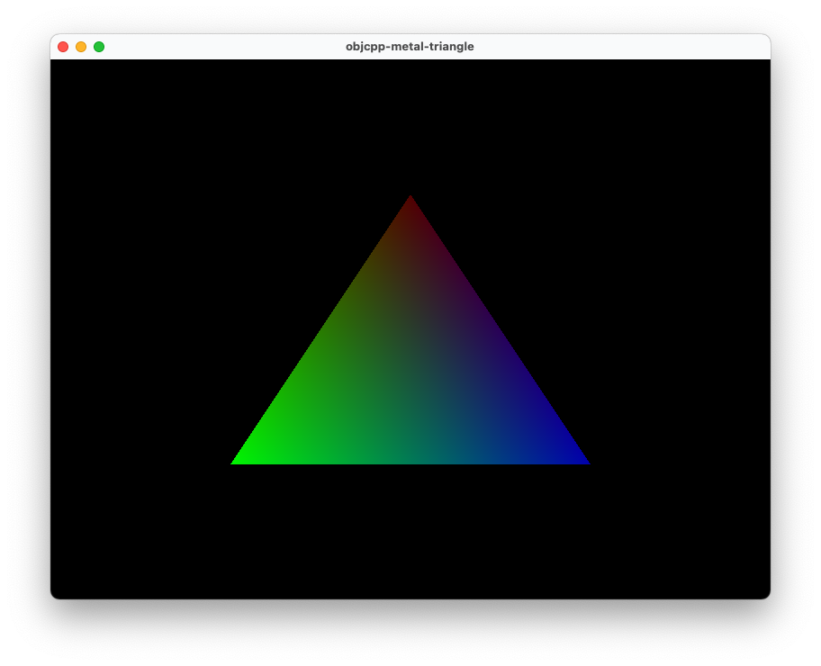

# objcpp-metal-triangle
Sample using Metal with objective-c++.  
Window provided by glfw.

## Build
```bash
mkdir build
cd build
cmake .. -G "Xcode"
cmake --build . --config Debug|Release
```

## Run
```bash
cd Debug|Release
./objcpp-metal-triangle
```


